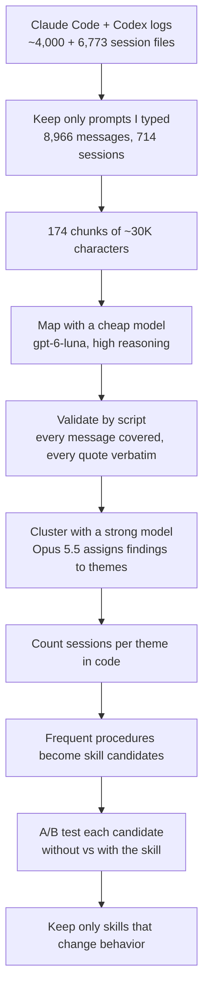

# Baspowers

Personal fork of [obra/superpowers](https://github.com/obra/superpowers): a set of composable skills for coding agents, plus the bootstrap that makes the agent use them.

- `skills/` — the skills
- `hooks/` — Claude Code `SessionStart` hook that injects `using-baspowers`
- `.claude-plugin/`, `.codex-plugin/`, `.agents/plugins/` — plugin and local marketplace manifests for Claude Code and Codex

## Skills

Upstream is [obra/superpowers](https://github.com/obra/superpowers) v6.4.2 plus later bug fixes from its `dev` branch.
Every upstream skill is renamed from superpowers to baspowers; that rename alone does not count as a change.

### Original to Baspowers (6)

| Skill | What it does |
|---|---|
| `consulting-cross-model` | Ask another model about an ambiguous, costly decision |
| `merging-when-approved` | Merge only after independent reviewers approve the exact head |
| `scoring-pull-requests` | Verdict-first scorecard: net production LOC, root cause or bandage, risk |
| `stopping-runaway-prs` | Stop and re-plan when a change outgrows its estimate or reviews keep finding defects |
| `reporting-status` | Open items only, with how far each got |
| `triaging-pr-backlogs` | Close what is provably redundant, merge what passes review, report the rest |

### Modified from Superpowers (11)

| Skill | What it does | What changed |
|---|---|---|
| `using-baspowers` | Bootstrap: pick the skills that apply at the start of each task | Loads skills once per task instead of before every response; agent decides routine, reversible work itself; adds a terse response style adapted from [caveman](https://github.com/JuliusBrussee/caveman) |
| `brainstorming` | Turn an idea into a checked design before building | No approval gates (agent presents the design and proceeds); keeps v6.4.2, not the unreleased `dev` rebuild |
| `writing-plans` | Write a step-by-step implementation plan from a spec | Agent picks the execution mode instead of asking |
| `executing-plans` | Execute a plan yourself in this session, with one final review | Creates an isolated branch instead of asking for consent |
| `subagent-driven-development` | Execute a plan task by task with fresh subagents and reviews | Creates an isolated branch instead of asking for consent |
| `test-driven-development` | Write a failing test first, then the code | Agent decides the named exceptions instead of asking |
| `systematic-debugging` | Find the root cause before proposing a fix | After three failed fixes, consults another model instead of asking |
| `receiving-code-review` | Verify review feedback instead of blindly applying it | Investigates instead of asking; consults another model when feedback conflicts with a recorded decision |
| `using-git-worktrees` | Isolate feature work in a git worktree | Rewritten: 1063 to 354 words; reuses a worktree only if it is fresh |
| `finishing-a-development-branch` | Decide how to merge, PR, or clean up finished work | Follows the requested outcome instead of presenting an options menu |
| `diagnosing-baspowers` | Diagnose from transcripts why a session went wrong | Was `diagnosing-superpowers`. GitHub issue step removed |

### Copied from Superpowers (4)

Identical to upstream apart from the rename.

| Skill | What it does |
|---|---|
| `dispatching-parallel-agents` | Run independent tasks in parallel subagents |
| `verification-before-completion` | Run the checks before claiming anything works |
| `requesting-code-review` | Get a review before merging |
| `writing-skills` | Create, edit, and test skills |

## How the delivery skills were made

`merging-when-approved`, `scoring-pull-requests`, `stopping-runaway-prs`, `reporting-status` and `triaging-pr-backlogs` come from my own agent history, not from guesswork.
This is the process, so you can run it on yours.



1. **Collect** `~/.claude/projects/**/*.jsonl`, `~/.codex/sessions/**/rollout-*.jsonl`, and each tool's `history.jsonl`, which still holds prompts from deleted sessions.
2. **Keep only your own words.**
   Drop subagent threads, `codex exec` and `claude -p` runs (their prompts are written by agents), injected context such as `AGENTS.md` and environment blocks, and duplicates.
   Redact secrets and truncate long pastes.
3. **Map cheaply.**
   A cheap model reads each chunk with a JSON schema and returns a digest covering every message, plus principles, repeated requests, procedures and corrections, each with verbatim quotes and message references.
4. **Check the cheap model.**
   Pilot a few chunks and compare them with the raw text by hand; this caught pasted AI reviews being attributed to me.
   Then let a script confirm that every message is covered and every quote is verbatim.
5. **Cluster with a strong model, count with code.**
   Subagents only assign finding IDs to themes, and a script counts distinct sessions per theme.
   Letting the cheap model merge findings lost 22% of the references.
6. **A/B test every candidate** with `writing-skills`: run realistic scenarios with combined pressures without the skill (5 runs) and with it (10 runs), and quote the baseline's actual excuses in the Red Flags.
   Of ten candidates, four were dropped because agents already behaved without them, and one because it only fit my own deployment setup.

| Stage | Model | Calls | Tokens | Cost at list price |
|---|---|---|---|---|
| Map, including pilots | gpt-6-luna, high reasoning | 182 | 4.1M in, 0.74M out | ~$0.62 |
| Cheap merge, discarded | gpt-6-luna, high reasoning | 18 | 0.52M in, 0.18M out | ~$0.14 |
| Clustering | Opus 5.5 | 5 subagents | ~0.87M | ~$5 |
| A/B tests | Sonnet 5.5 | ~240 runs | ~1.6M in, ~0.3M out | ~$6 |

That is about 8M tokens, or roughly $12 at API list prices, not counting the session that orchestrated it.
Luna is priced at $0.10 per 1M input and $0.50 per 1M output tokens, with 90% off cached input ([Artificial Analysis](https://artificialanalysis.ai/models/releases/gpt-6-luna)).
The clustering cost is an estimate because its input and output split was not logged.
I ran everything on existing subscriptions.

## Install

```bash
claude plugin marketplace add /path/to/baspowers
claude plugin install baspowers@baspowers-dev

codex plugin marketplace add /path/to/baspowers
codex plugin add baspowers@baspowers-dev
```

## License

MIT — see [LICENSE](LICENSE).
