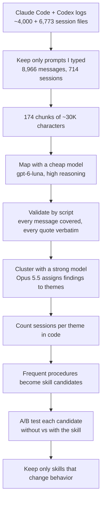

<h1 align="center">
  
</h1>

My set of composable skills for coding agents, plus the bootstrap that makes the agent use them.
It started as a fork of [obra/superpowers](https://github.com/obra/superpowers) and has grown well beyond it.

- `skills/` — the skills
- `hooks/` — Claude Code `SessionStart` hook that injects `using-baspowers`
- `.claude-plugin/`, `.codex-plugin/`, `.agents/plugins/` — plugin and local marketplace manifests for Claude Code and Codex

## What's different from Superpowers

1. **The agent decides.**
   Superpowers stops for your approval at each stage: the design, the spec, the plan, the execution mode, and the finish.
   Baspowers lets the agent make routine, reversible decisions itself, say what it decided, and keep going.
   It stops only for information it cannot find, a real change of scope, or an irreversible or external action such as a merge or a push.
2. **Ambiguity goes to a second model, not to you.**
   When a hard technical decision stays ambiguous after the agent has read the code, tests, and history, it asks the other model family for advice (Claude asks GPT-6 Astra, Codex asks Claude Opus 5.5), then decides.
   The same second model also reviews pull requests before they are merged.
3. **Cruft removed.**
   Integrations for harnesses I don't use (Cursor, Gemini, OpenCode, Pi, Hermes, and others), development leftovers, and duplicated docs are gone, and skills load once per task instead of before every reply.
4. **No contradictions.**
   Every skill was audited so that it agrees with itself and with the other skills; GPT-6 in particular stalls on conflicting skill instructions.
5. **Aligned with current prompting guides, and tested.**
   Changes are checked against the latest prompting guides from Anthropic (Claude Opus 5.5) and OpenAI (GPT-6), and the riskier ones are A/B tested on Claude Opus, Claude Haiku, GPT-6 Sol, and GPT-6 Luna (see [Methodology](#methodology)).

It also adds:

- original skills, most of them mined from my own agent history and A/B tested (see [how they were made](#how-the-delivery-skills-were-made));
- a terse response style adapted from [caveman](https://github.com/JuliusBrussee/caveman) and [i-have-adhd](https://github.com/ayghri/i-have-adhd), built into the bootstrap;
- minimal-change coding rules adapted from [ponytail](https://github.com/DietrichGebert/ponytail), also in the bootstrap;
- a `/wait-what` command from [mattpocock/skills](https://github.com/mattpocock/skills) for replies that did not land.

See [Skills](#skills) for what is original, modified, copied, or adapted.

## Skills

Upstream is [obra/superpowers](https://github.com/obra/superpowers) v6.4.2 plus later bug fixes from its `dev` branch.
Every upstream skill is renamed from superpowers to baspowers; that rename alone does not count as a change.
`SKILL.md` size compares word counts with upstream v6.4.2; supporting files are not counted, and the skill body is what loads each time a skill triggers.

### Original to Baspowers (7)

| Skill | What it does |
|---|---|
| `consulting-cross-model` | Ask another model about an ambiguous, costly decision |
| `merging-when-approved` | Merge only after independent reviewers approve the exact head |
| `scoring-pull-requests` | Verdict-first scorecard: net production LOC, root cause or bandage, risk |
| `stopping-runaway-prs` | Stop and re-plan when a change outgrows its estimate or reviews keep finding defects |
| `reporting-status` | Open items only, with how far each got |
| `triaging-pr-backlogs` | Close what is provably redundant, merge what passes review, report the rest |
| `avoiding-shell-traps` | Wait for, find, and stop processes, pass file lists, and commit after hooks without silent failures |

### Modified from Superpowers (14)

| Skill | What it does | What changed | `SKILL.md` size |
|---|---|---|---|
| `using-baspowers` | Bootstrap: pick the skills that apply at the start of each task | Loads skills once per task instead of before every response; agent decides routine, reversible work itself; adds a terse response style adapted from [caveman](https://github.com/JuliusBrussee/caveman), with a five-item list cap from [i-have-adhd](https://github.com/ayghri/i-have-adhd); adds minimal-change coding rules adapted from [ponytail](https://github.com/DietrichGebert/ponytail) | +120% (492 → 1083) |
| `brainstorming` | Turn an idea into a checked design before building | No approval gates (agent presents the design and proceeds); keeps v6.4.2, not the unreleased `dev` rebuild | -12% (2613 → 2287) |
| `writing-plans` | Write a step-by-step implementation plan from a spec | Agent picks the execution mode instead of asking and records it in the plan | -3% (1639 → 1593) |
| `executing-plans` | Execute a plan yourself in this session, with one final review | Creates an isolated branch instead of asking for consent | 0% (3267 → 3274) |
| `subagent-driven-development` | Execute a plan task by task with fresh subagents and reviews | Creates an isolated branch instead of asking for consent; controller rules on plan-mandated findings | +2% (4871 → 4980) |
| `test-driven-development` | Write a failing test first, then the code | Agent decides the named exceptions instead of asking | +7% (1475 → 1583) |
| `systematic-debugging` | Find the root cause before proposing a fix | Consults another model instead of asking for help, including after three failed fixes | +4% (1440 → 1499) |
| `requesting-code-review` | Get a review before merging | Reviews the whole branch by default; reviewer ends with a `VERDICT:` line | +3% (424 → 438) |
| `receiving-code-review` | Verify review feedback instead of blindly applying it | Investigates instead of asking; consults another model when feedback conflicts with a recorded decision | +6% (913 → 972) |
| `dispatching-parallel-agents` | Run independent tasks in parallel subagents | Parallel editors in one checkout touch disjoint files and leave git state alone | +5% (865 → 905) |
| `using-git-worktrees` | Isolate feature work in a git worktree | Rewritten; reuses a worktree only if it is fresh | -67% (1069 → 354) |
| `finishing-a-development-branch` | Decide how to merge, PR, or clean up finished work | Follows the requested outcome instead of an options menu; creates a branch on detached HEAD; cleans up only its own worktrees; never switches your main checkout | +4% (1269 → 1322) |
| `writing-skills` | Create, edit, and test skills | Quick-reference and red-flag sections only when testing shows a need; guidance for trimming existing skills | +2% (3814 → 3884) |
| `diagnosing-baspowers` | Diagnose from transcripts why a session went wrong | Was `diagnosing-superpowers`. Proposes skill changes instead of refusing to; GitHub issue step and scrubbed-bundle export removed | -26% (1065 → 785) |

### Copied from Superpowers (1)

Identical to upstream apart from the rename.

| Skill | What it does | `SKILL.md` size |
|---|---|---|
| `verification-before-completion` | Run the checks before claiming anything works | 0% (580 → 580) |

### Adapted from other projects (1)

| Skill | What it does | Source and changes |
|---|---|---|
| `wait-what` | Re-pitch a reply that did not land: context first, simple English, terms explained | [mattpocock/skills](https://github.com/mattpocock/skills/tree/main/skills/productivity/wait-what) (MIT); explains terms inline instead of requiring a `GLOSSARY.md`, and caps the re-pitch at 200 words |

## Methodology

How the upstream skills were changed, and the evidence behind each decision.

### Principles

1. **Spend tokens only where they change behavior.**
   A skill body loads in full each time the skill triggers, and `using-baspowers` is injected into every Claude Code session.
   So I cut what agents already know (so far: the git and setup commands in `using-git-worktrees`), files that never load or target removed harnesses, and text that contradicts other skills.
   I did not trim for its own sake: most `SKILL.md` files are now slightly longer than upstream, because the fixes add rules (see the size column above), while dead supporting files are gone.
2. **Layout over length.**
   Checklists and question lists stay as separate lines; an agent answers each listed question, while the same items in a comma-separated sentence get skimmed.
   On weaker models, numbered steps with exact commands beat prose with the same content.
3. **No contradictions.**
   OpenAI's [GPT-6 guide](https://developers.openai.com/api/docs/guides/latest-model) warns that the model "can be more sensitive to instructions contained in skills" and that "unclear or conflicting guidance in a skill file may cause the model to pause and block work early".
   I audited every skill for contradictions, within a skill and between skills, and fixed each in its own commit.
4. **Test behavior, not text.**
   Each experiment ran the old version, the new version, and often a no-skill control on a realistic task in a throwaway repo, scored from what the agent did (files, git state, order of tool calls), not from what it said.
   Models: Claude Opus 5.5, Claude Haiku 4.5 at low effort, GPT-6 Sol, and GPT-6 Luna at low effort.

### Experiments

| Question | Setup | Result | Decision |
|---|---|---|---|
| Rewrite `using-git-worktrees` (1069 → 354 words) | Session starts in a worktree another agent is using, in a fresh worktree, or in the main checkout; Opus, Haiku, Luna | The original committed on top of the other agent's work in every dirty-worktree run (0/3 Opus, 0/5 Luna, 0/3 Haiku). The final version: 9/9 Opus, 15/15 Luna. A prose draft scored 12/15 on Luna; numbered steps fixed it. Haiku at low effort was unreliable with every version. | Shipped the numbered version |
| Does the bootstrap still trigger brainstorming? | "Let's make a react todo list", old vs new `using-baspowers`; Opus, Haiku | Brainstorming before any code: 8/8 old, 8/8 new | Kept |
| Load skills once per task, instead of before every response | 3 turns in one session (feature, bug, status); 16 sessions on Opus and Sol | Identical: the right skill each turn and no skill re-read within a turn. GPT-6 Sol did not repeat GPT-5.6 Sol's habit of re-reading skills at every tool call, even with the old text. | Kept once per task |
| "YOU MUST / NEVER / NO EXCEPTIONS" vs calm wording with reasons | `test-driven-development`: a bug fix under time pressure, plus a README-only change; 144 runs on all four models | Test written and seen failing first: no skill 0/32, emphatic 32/32, calm 32/32. No version invented tests for the README change (0/48). | No rewrite of existing skills; new skills use calm wording |
| Why does Claude skip brainstorming on some feature requests? | Opus, fully specified vs vague vs larger requests | Fully specified small change: 0/8 (goes straight to TDD). Vague or larger: 8/8. | Left as is: it brainstorms when there is something to design |
| Blanket trim of 13 skills for length | Wording-only rewrites, checked by an independent old-vs-new comparison | The text checks passed, but lists were folded into prose and comma-separated lines | Withdrawn before merging |

### Vendor guidance and research applied

- **Claude Opus 5.5** ([guide](https://platform.claude.com/docs/en/build-with-claude/prompt-engineering/prompting-claude-opus-5-5)): the model is "responsive to instructions that name the specific kinds of early stop you want it to avoid", and long tasks should "keep the task's parts in a checklist the model updates".
  Discipline skills keep short, specific red-flag lists, and checklists stay checklists.
- **Claude prompting best practices** ([guide](https://platform.claude.com/docs/en/build-with-claude/prompt-engineering/claude-prompting-best-practices)): newer models "may now overtrigger" on prompts written against undertriggering, so "dial back any aggressive language"; and use "numbered lists or bullet points when the order or completeness of steps matters".
  My TDD test found no measurable difference between emphatic and calm wording, so existing skills keep theirs and new skills are written calmly.
- **GPT-6** ([guide](https://developers.openai.com/api/docs/guides/latest-model)): "We strongly recommend auditing skills", and "The user's instructions take precedence over guidelines provided in a skill."
  This drove the contradiction audit; `using-baspowers` already states that user instructions win.
- **Persuasion techniques**: upstream's `writing-skills` shipped a guide recommending Cialdini-style authority language ("YOU MUST") for skills, citing research on persuading models to comply with objectionable requests rather than on following instructions.
  I removed it.
  [PACT](https://arxiv.org/abs/2609.18605) (2026, 22 models) is a better fit: ordinary user pressure raises rule violations by 65% on average, which is why discipline skills keep their pressure-specific red flags.

### What was not tested

- The 36 behavior fixes in the cleanup (contradictions, bugs, and design changes such as the review mode in `consulting-cross-model`) were checked by review and by reading old against new, not by A/B runs.
- The harnesses and run logs for these experiments were run locally and are not in this repository.

## How the delivery skills were made

`merging-when-approved`, `scoring-pull-requests`, `stopping-runaway-prs`, `reporting-status` and `triaging-pr-backlogs` come from my own agent history, not from guesswork.
This is the process, so you can run it on yours.



1. **Collect** `~/.claude/projects/**/*.jsonl`, `~/.codex/sessions/**/rollout-*.jsonl`, and each tool's `history.jsonl`, which still holds prompts from deleted sessions.
2. **Keep only your own words.**
   Drop subagent threads, `codex exec` and `claude -p` runs (their prompts are written by agents), injected context such as `AGENTS.md` and environment blocks, and duplicates.
   Redact secrets and truncate long pastes.
3. **Map cheaply.**
   A cheap model reads each chunk with a JSON schema and returns a digest covering every message, plus principles, repeated requests, procedures and corrections, each with verbatim quotes and message references.
4. **Check the cheap model.**
   Pilot a few chunks and compare them with the raw text by hand; this caught pasted AI reviews being attributed to me.
   Then let a script confirm that every message is covered and every quote is verbatim.
5. **Cluster with a strong model, count with code.**
   Subagents only assign finding IDs to themes, and a script counts distinct sessions per theme.
   Letting the cheap model merge findings lost 22% of the references.
6. **A/B test every candidate** with `writing-skills`: run realistic scenarios with combined pressures without the skill (5 runs) and with it (10 runs), and quote the baseline's actual excuses in the Red Flags.
   Of ten candidates, four were dropped because agents already behaved without them, and one because it only fit my own deployment setup.

| Stage | Model | Calls | Tokens | Cost at list price |
|---|---|---|---|---|
| Map, including pilots | gpt-6-luna, high reasoning | 182 | 4.1M in, 0.74M out | ~$0.62 |
| Cheap merge, discarded | gpt-6-luna, high reasoning | 18 | 0.52M in, 0.18M out | ~$0.14 |
| Clustering | Opus 5.5 | 5 subagents | ~0.87M | ~$5 |
| A/B tests | Sonnet 5.5 | ~240 runs | ~1.6M in, ~0.3M out | ~$6 |

That is about 8M tokens, or roughly $12 at API list prices, not counting the session that orchestrated it.
Luna is priced at $0.10 per 1M input and $0.50 per 1M output tokens, with 90% off cached input ([Artificial Analysis](https://artificialanalysis.ai/models/releases/gpt-6-luna)).
The clustering cost is an estimate because its input and output split was not logged.
I ran everything on existing subscriptions.

## Install

```bash
claude plugin marketplace add /path/to/baspowers
claude plugin install baspowers@baspowers-dev

codex plugin marketplace add /path/to/baspowers
codex plugin add baspowers@baspowers-dev
```

## License

MIT — see [LICENSE](LICENSE).
